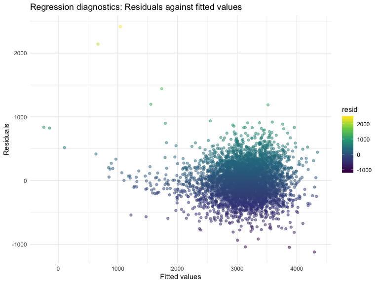
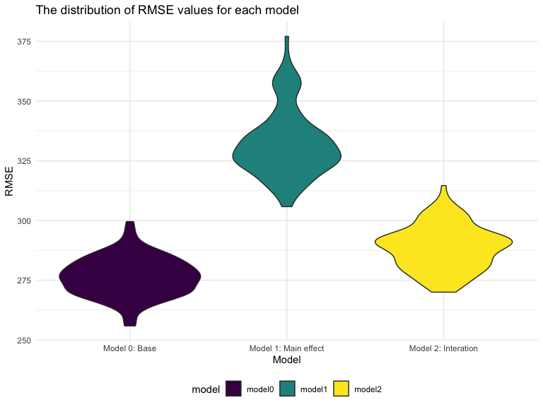

p8105\_hw6\_yc3508
================
Yama Chang
2019/11/24

## Problem 1

1.1 Read and tidy the birthweight
data

``` r
birthweight = read_csv(file = "./data/birthweight.csv", col_types = NULL, col_names = TRUE) %>%
  janitor::clean_names() 
```

    ## Parsed with column specification:
    ## cols(
    ##   .default = col_double()
    ## )

    ## See spec(...) for full column specifications.

``` r
class(birthweight$wtgain)
```

    ## [1] "numeric"

``` r
birthweight = birthweight %>% 
  drop_na() %>% 
  mutate(
    babysex = as.factor(recode(babysex, `1` = "male", `2` = "female")),
    frace = as.factor(recode(frace, `1` = "White", `2` = "Black", `3` = "Asian", `4` = "Puerto Rican", `8` = "Other", `9` = "Unknown")),
    malform = as.factor(recode(malform, `0` = "absent", `1` = "present")),
    mrace = as.factor(recode(frace, `1` = "White", `2` = "Black", `3` = "Asian", `4` = "Puerto Rican", `8` = "Other"))
  ) %>% 
  mutate(
    frace = relevel(frace, "White"),
    mrace = relevel(mrace, "White")
  )
```

1.2 Build a regression model to predict baby birthweight

According to [Secker-Walker &
Vacek, 2003](https://www.ncbi.nlm.nih.gov/pubmed/12507527) and [Catov et
al., 2015](https://www.ncbi.nlm.nih.gov/pubmed/26667251), the effect of
smoking, gestational age, maternal weight gain during pregnancy are
associated to infant birthweight. Also, race disparities are related to
birthweight and birth size. Therefore, we propose `smoken`, `wtgain`,
`bhead`, `blength`, `mrace`, `gaweeks` as predictors in this regression
model, since we hyphothesized that the biological and environmental
change (i.e., weight gain, smoking behavior, gestational age) of mother
during pregnant and baby’s birth size (e.g., baby’s head circumference,
baby’s length) at birth might influence baby birthweight. Also, we
wanted to examine whether the race of mother would show difference of
birth weight of
babies.

``` r
bw = lm(bwt ~ smoken + wtgain + bhead + blength + mrace + gaweeks, data = birthweight)

bw %>% 
  broom::tidy() %>% 
  select(term, estimate, p.value) %>% 
  mutate(term = str_replace(term, "^mrace", "mom_race: ")) %>% 
  knitr::kable(digits = 3)
```

| term                    |   estimate | p.value |
| :---------------------- | ---------: | ------: |
| (Intercept)             | \-5605.104 |   0.000 |
| smoken                  |    \-4.512 |   0.000 |
| wtgain                  |      3.819 |   0.000 |
| bhead                   |    131.514 |   0.000 |
| blength                 |     77.002 |   0.000 |
| mom\_race: Asian        |   \-88.539 |   0.032 |
| mom\_race: Black        |  \-139.723 |   0.000 |
| mom\_race: Other        |   \-48.699 |   0.511 |
| mom\_race: Puerto Rican |  \-131.549 |   0.000 |
| gaweeks                 |     11.859 |   0.000 |

1.3 model residuals

``` r
bw_model = modelr::add_residuals(birthweight, bw)
bw_model = modelr::add_predictions(bw_model, bw)

bw_model %>% 
  ggplot(aes(x = pred, y = resid, color = resid)) + 
  geom_point(alpha = .5) + 
  theme(legend.position = "right") +
  labs(
    x = "Fitted values",
    y = "Residuals",
    title = "Regression diagnostics: Residuals against fitted values"
  )
```



1.4 Compare to two other model

**Model 1: using length at birth and gestational age as predictors**

``` r
bw1 = lm(bwt ~ blength + gaweeks, data = birthweight)
```

**Model 2: using head circumference, length, sex, and all interactions
(including the three-way interaction) between
these**

``` r
bw2 = lm(bwt ~ bhead + blength + babysex + bhead * blength + bhead * babysex + blength * bhead + bhead * blength * babysex, data = birthweight)
```

**Fit these three models and obtain RMSEs**

``` r
cv_df = 
  crossv_mc(birthweight, 100) 

cv_df = cv_df %>% 
  mutate(
    model0 = map(train, ~lm(bwt ~ smoken + wtgain + bhead + blength + mrace + gaweeks, data = .)),
    model1 = map(train, ~lm(bwt ~ blength + gaweeks, data = .)),
    model2 = map(train, ~lm(bwt ~ bhead + blength + babysex + bhead * blength + bhead * babysex + blength * bhead + bhead * blength * babysex, data = .)),
  ) %>% 
  mutate(
    rmse_model0 = map2_dbl(model0, test, ~rmse(model = .x, data = .y)),
    rmse_model1 = map2_dbl(model1, test, ~rmse(model = .x, data = .y)),
    rmse_model2 = map2_dbl(model2, test, ~rmse(model = .x, data = .y))
  )

cv_df %>% 
  select(starts_with("rmse")) %>% 
  pivot_longer(
    everything(),
    names_to = "model",
    values_to = "rmse",
    names_prefix = "rmse_"
  ) %>% 
  mutate(model = fct_inorder(model)) %>% 
  ggplot(aes(x = model, y = rmse, fill = model)) + 
  geom_violin() +
  labs(
    x = "Model",
    y = "RMSE",
    title = "The distribution of RMSE values for each model"
  ) +
  scale_x_discrete(labels=c("model0" = "Model 0: Base", "model1" = "Model 1: Main effect",
                              "model2" = "Model 2: Interation"))
```



By comparison of these three models, we found that “model 0: base” can
predict the birthweight most accurate.

## Problem 2
